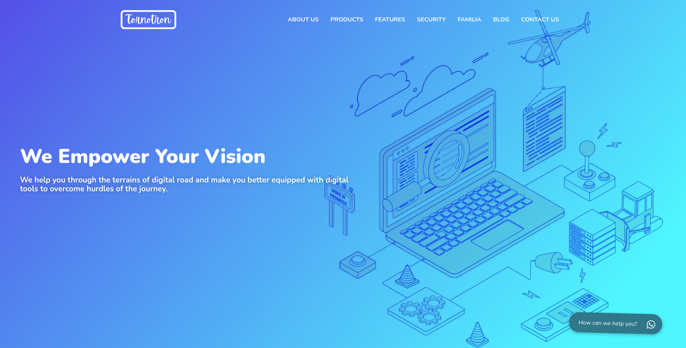
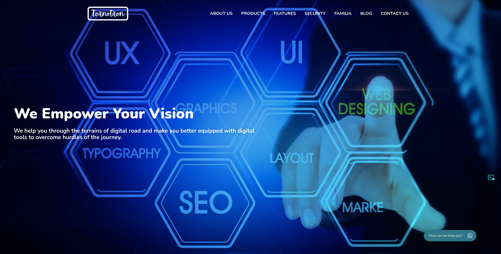

<div align="center">


</div>

<!-- PROJECT LOGO -->
<br />
<div align="center">
  <a href="https://github.com/tornotron">
    
  </a>
  <h3 align="center">FreshStart Marketing Website Theme</h3>
  <div align="center">
    A fully customized theme for digital marketing website on WordPress 
    <br />
    <a href="https://github.com/abhijithanandan/FreshStart-Website/docs/README.md"><strong>Explore the docs »</strong></a>
    <br />
    <br />
    <a href="https://github.com/abhijithanandan/FreshStart-Website/demo/README.md">View Demo</a>
    ·
    <a href="https://github.com/abhijithanandan/FreshStart-Website/issues">Report Bug</a>
    ·
    <a href="https://github.com/abhijithanandan/FreshStart-Website/issues">Request Feature</a>
  </div>
</div>

<!-- TABLE OF CONTENTS -->
<details open>
  <summary>Table of Contents</summary>
  <ol>
    <li>
      <a href="#about-the-project">About The Project</a>
      <ul>
        <li><a href="#built-with">Built With</a></li>
      </ul>
    </li>
    <li>
      <a href="#getting-started">Getting Started</a>
      <ul>
        <li><a href="#prerequisites">Prerequisites</a></li>
        <li><a href="#installation">Installation</a></li>
      </ul>
    </li>
    <li><a href="#usage">Usage</a></li>
    <li><a href="#contributing">Contributing</a></li>
    <li><a href="#license">License</a></li>
    <li><a href="#contact">Contact</a></li>
    <li><a href="#acknowledgments">Acknowledgments</a></li>
  </ol>
</details>

<!-- ABOUT THE PROJECT -->
## About The Project

<div align="center">
  
  
 
  <!-- Add vertical space -->
  <br>  
  <br>  
  <br>  

</div>

* This is a Marketing Website WordPress Theme specifically tailored for businesses wishing to establish a strong online presence.
* This theme boasts of a sophisticated, modern, and scalable backend architecture, designed with an emphasis on low latency and high throughput deployment for optimal performance.

## Major Features Include:

- 🛡️ **Secure and SEO-Friendly**: Ensures the privacy, security, and visibility of your website, aligning with best SEO practices to enhance your site’s search engine ranking.
- 🎨 **Customizable Design**: Personalize the look and feel of your website, matching it perfectly with your brand identity and aesthetics.
- 📢 **Effective Marketing Tools**: Integrated tools for content marketing, email campaigns, social media sharing, and analytics to optimize your marketing strategies.
- 📞 **Contact and Lead Management**: Convenient forms and lead management tools to effectively connect with your audience and manage relationships.
- 💼 **Portfolio Showcase**: Display your best work, projects, or case studies in an organized and attractive layout.
- 📝 **Blog Integration**: Share valuable insights, updates, and articles with integrated blog functionality.
- 🛍️ **E-Commerce Ready**: The theme is ready for e-commerce features, making it easy to showcase and sell products or services directly from your site.
- 📱 **Responsive Design**: Ensures your website looks great and functions flawlessly on all devices and screen sizes.
- 🚀 **High Performance**: Optimized for speed and performance to provide users with a seamless browsing experience.
- 🌐 **Multilingual Support**: Reach a global audience with multilingual support, allowing you to cater to diverse user groups.

<p align="right">(<a href="#readme-top">back to top</a>)</p>

### Built With

<!-- Using Devicon font -->
<!--  -->  
<!-- * [![Flutter][Flutter-Icon]][https://flutter.dev] -->

<!-- Using skill-icons -->
<div align="center">
  <a href="https://skillicons.dev">
    
  </a>
</div>

<p align="right">(<a href="#readme-top">back to top</a>)</p>

<!-- Using Shields.io and Simple Icons -->
<!--    -->


<!-- GETTING STARTED -->
## 🚀 Getting Started

This theme can be installed on any WordPress compatible hosting environment. It has been built with the latest WordPress standards for maximum compatibility and ease of use. The following instructions will guide you to get a copy of the project up and running on your local machine for development and testing purposes.
### Prerequisites

This is an example of how to list things you need to use the software and how to install them.

* Ensure you have a local development environment for WordPress (like XAMPP, MAMP, or Local by Flywheel).
* If not, follow this [WordPress installation guide](https://developer.wordpress.org/advanced-administration/before-install/howto-install) for your operating system.
* Ensure GitHub SSH is set up on your system.
* If not, follow the [GitHub SSH setup guide](https://docs.github.com/en/authentication/connecting-to-github-with-ssh) for your operating system.
### Installation
1. Run the tornotron automation scripts to setup local dev environment
2. Clone this repository using the command: 
    ```sh
    git clone git@github.com:tornotron/prepacademy.git
    ```
3. Ensure to clone the repo to the correct directory of a new local installation

<p align="right">(<a href="#readme-top">back to top</a>)</p>


<!-- USAGE EXAMPLES -->
## Usage

### Demo Coming Soon!

<p align="right">(<a href="#readme-top">back to top</a>)</p>

<!-- CONTRIBUTING -->
## Contributing

Contributions are what make the open source community such an amazing place to learn, inspire, and create. Any contributions you make are **greatly appreciated**.

If you have a suggestion that would make this better, please fork the repo and create a pull request. You can also simply open an issue with the tag "enhancement".
Don't forget to give the project a star! Thanks again!

1. Fork the Project
2. Create your Feature Branch (`git checkout -b feature/AmazingFeature`)
3. Commit your Changes (`git commit -m 'Add some AmazingFeature'`)
4. Push to the Branch (`git push origin feature/AmazingFeature`)
5. Open a Pull Request

<p align="right">(<a href="#readme-top">back to top</a>)</p>


<!-- LICENSE -->
## License

Distributed under the GNU License. See `LICENSE.txt` for more information.

<p align="right">(<a href="#readme-top">back to top</a>)</p>


<!-- CONTACT -->
## Contact

Abhijith Anandakrishnan - [@abhijithanandan](https://twitter.com/abhijithanandan) - info@abhijithanandan.com 

Project Link: [https://github.com/abhijithanandan/FreshStart-Website](https://github.com/abhijithanandan/FreshStart-Website)

<p align="right">(<a href="#readme-top">back to top</a>)</p>

## Branch Ownership

 | Status | Branch | Owner
 | --- | --- | ---
 |  | `development` | [Abhijith Anandakrishnan](abhijithananthan@gmail.com)


<!-- ACKNOWLEDGMENTS -->
## Acknowledgments

* Tornotron E Commerce Private Ltd. - [https://tornotron.com](https://tornotron.com)

<p align="right">(<a href="#readme-top">back to top</a>)</p>
